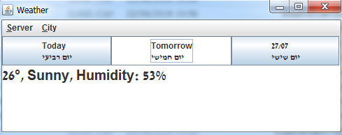
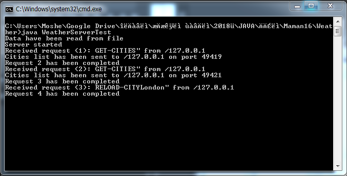

# WheaterSync

Weather server get data from file and send requested data by selected city.
Client display the data with options to change server and port and report connectivity status.

## Highlights:
* Java
* Working with files.
* Java GUI
* Java Networking

## Screenshots:  
* Client  
	  
* Server
	  